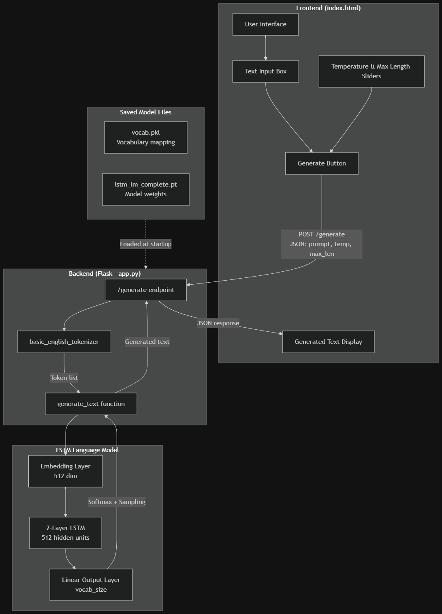
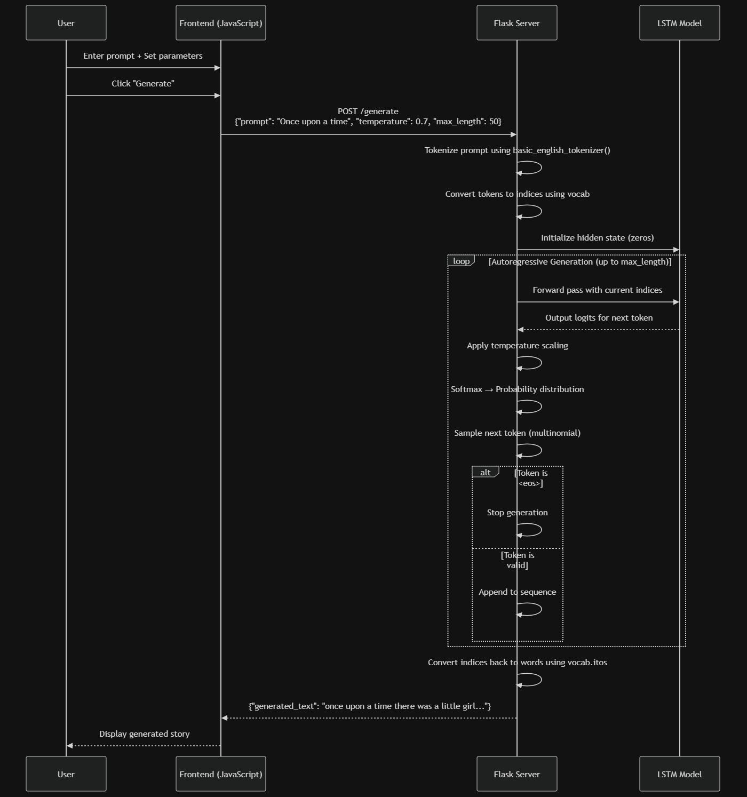
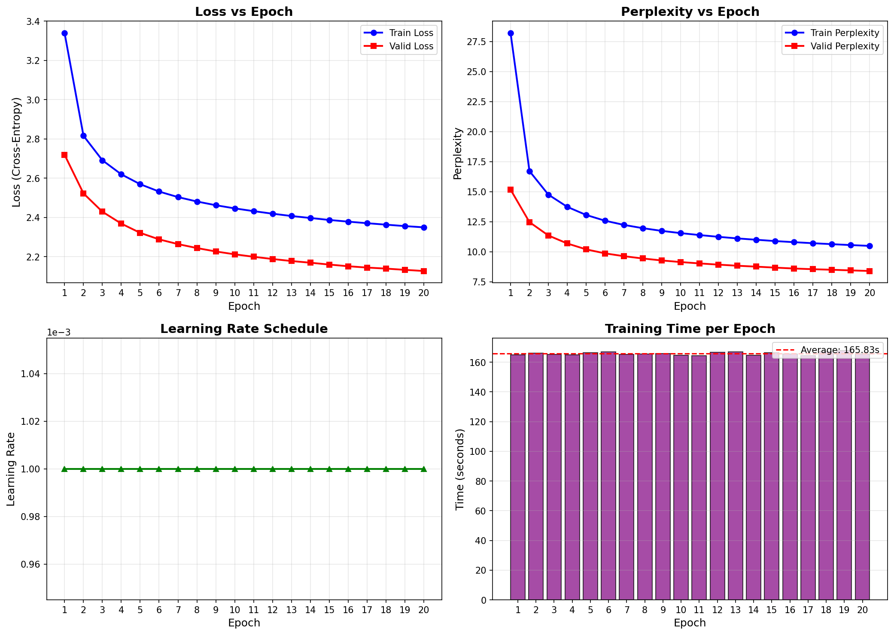

# A2: Language Model

**NLU Assignment 2** — LSTM Language Model  
**Student**: Dechathon Niamsa-ard [st126235]

---

## Overview

This project implements an LSTM-based language model for text generation, trained on the TinyStories dataset. The model learns to predict the next token in a sequence and can generate coherent short stories from user prompts. A Flask web application provides an interactive interface for text generation.

---

## Project Structure

```
├── app/                              # Flask web application
│   ├── app.py                       # Main Flask server
│   └── templates/index.html         # Generation interface
├── assets/                           # Training visualizations
│   └── training_metrics.png         # Loss/perplexity plots
├── lab_02/                           # Lab reference notebooks
│   ├── LSTM LM.ipynb                # Original lab notebook
│   └── Appendix - LSTM + Attention from Scratch.ipynb
├── model/                            # Saved model weights
│   ├── lstm_lm_complete.pt          # Trained model checkpoint
│   └── vocab.pkl                    # Vocabulary file
├── st126235_assignment_2.ipynb       # Main notebook (training + evaluation)
├── pyproject.toml                    # Project config
└── README.md                         # This file
```

---

## Quick Start

```bash
# Setup environment
uv venv && uv sync
# Or: pip install -r requirements.txt

# Train model (run notebook cells)
jupyter notebook st126235_assignment_2.ipynb

# Run web app
cd app && python app.py
```

Open http://localhost:5000 in your browser.

---

## Task 1: Dataset Acquisition (1 point)

**Objective**: Find a suitable text dataset for language modeling.

### What I Chose:
- **TinyStories** dataset from Microsoft Research
- Source: https://huggingface.co/datasets/roneneldan/TinyStories
- Synthetic dataset of short stories using vocabulary a 3-4 year old would understand
- Clean, grammatically correct text ideal for training language models

### Dataset Statistics:

| Split | Original Size | My Subset |
|-------|---------------|-----------|
| Training | 2,119,719 | 100,000 |
| Validation | 21,990 | ~11,000 |
| Test | — | ~11,000 |

### Why TinyStories:
- Text-rich with consistent narrative structure
- Clean synthetic data (no typos, slang, or noise)
- Manageable size for training on personal hardware
- Proper grammar and logical story flow

---

## Task 2: Model Training (2 points)

**Objective**: Preprocess data and train an LSTM language model.

### Preprocessing Pipeline:

1. **Tokenization** — Basic English tokenizer (lowercase + punctuation separation)
2. **Vocabulary Building** — Words appearing ≥3 times (reduces noise)
3. **Special Tokens** — `<unk>` (unknown) and `<eos>` (end of sequence)
4. **Numericalization** — Convert tokens to integer indices
5. **Batching** — Reshape into contiguous sequences for efficient training

### Model Architecture:

| Component | Configuration |
|-----------|---------------|
| Embedding Layer | 512 dimensions |
| LSTM Layers | 2 stacked layers |
| Hidden Dimension | 512 units |
| Dropout Rate | 0.5 |
| Output Layer | Linear → Vocabulary size |
| **Total Parameters** | **~19.6M** |

### LSTM Gates:
The model uses standard LSTM cells with forget, input, and output gates to handle long-range dependencies. Mathematical details are documented in the notebook.

### Training Configuration:

| Setting | Value |
|---------|-------|
| Epochs | 20 |
| Sequence Length | 50 (TBPTT) |
| Batch Size | 64 |
| Learning Rate | 0.001 (Adam) |
| Gradient Clipping | 0.25 |
| LR Scheduler | ReduceLROnPlateau |

### Training Results:

| Metric | Value |
|--------|-------|
| Best Validation Loss | 2.13 |
| Best Validation Perplexity | 8.39 |
| Test Loss | 2.09 |
| Test Perplexity | 8.12 |
| Total Training Time | ~55 minutes |

---

## Task 3: Web Application (2 points)

**Objective**: Build a web interface for text generation.


### Features

- **Flask web app** with clean, minimal UI
- **Text input** — Enter any story prompt
- **Temperature control** — Adjust creativity (0.5 = focused, 1.0 = creative)
- **Max length slider** — Control generation length
- **Example prompts** — Quick-start buttons for common story starters

### System Architecture




### Request-Response Flow



### How the Web App Interfaces with the Language Model

#### 1. Model Loading (Server Startup)

When the Flask server starts, it loads two files from the `model/` directory:

- **vocab.pkl**: The vocabulary object containing `stoi` (string-to-index) and `itos` (index-to-string) mappings, built during training with `min_freq=3`
- **lstm_lm_complete.pt**: A checkpoint containing model hyperparameters (`vocab_size`, `emb_dim=512`, `hid_dim=512`, `num_layers=2`, `dropout_rate=0.5`) and the trained weights

The model is initialized with these hyperparameters and set to evaluation mode (`model.eval()`).

#### 2. Text Generation Pipeline

When a user submits a prompt, the following steps occur:

| Step | Component | Description |
|------|-----------|-------------|
| 1 | `basic_english_tokenizer()` | Lowercases text, separates punctuation, splits into tokens |
| 2 | Vocabulary lookup | Each token is converted to its integer index via `vocab[token]` |
| 3 | Hidden state init | LSTM hidden and cell states initialized to zeros |
| 4 | Forward pass | Token indices → Embedding → LSTM → Linear → Logits |
| 5 | Temperature scaling | Logits divided by temperature before softmax |
| 6 | Sampling | `torch.multinomial()` samples from probability distribution |
| 7 | Repeat | New token appended, process repeats until `<eos>` or max length |
| 8 | Detokenize | Indices converted back to words using `vocab.get_itos()` |

#### 3. Temperature Parameter

Temperature controls the randomness of generation:

- **Low (0.5)**: Sharper probability distribution → more deterministic, "safer" predictions
- **High (1.0)**: Flatter distribution → more diverse, creative outputs

Formula: $P(w_i) = \frac{\exp(z_i / T)}{\sum_j \exp(z_j / T)}$ where $T$ is temperature and $z$ are logits.

### API Endpoints

| Endpoint | Method | Description | Request Body | Response |
|----------|--------|-------------|--------------|----------|
| `/` | GET | Serves the main HTML interface | — | HTML page |
| `/generate` | POST | Generates text continuation | `{"prompt": str, "temperature": float, "max_length": int}` | `{"generated_text": str}` |
| `/health` | GET | Server health check | — | `{"status": "ok", "device": "cuda/cpu"}` |

### Running the App

```bash
cd app
python app.py
# Open http://localhost:5000
```

---

## Visualizations

The notebook includes:
- **Training loss curves** — Train vs validation loss over epochs
- **Perplexity plots** — Model confidence improvement
- **Learning rate schedule** — Adaptive LR reduction
- **Training time per epoch** — Performance metrics



---

## Generation Examples

```
Prompt: "Once upon a time"

Temperature 0.5 (focused):
"Once upon a time there was a little girl named lily. she loved to play 
in the park with her friends..."

Temperature 1.0 (creative):
"Once upon a time there was a boy named tim. tim had a big red ball. 
he liked to play with it every day..."
```

---

## Dataset Source

| Dataset | Description | Source |
|---------|-------------|--------|
| TinyStories | Synthetic short stories | [HuggingFace](https://huggingface.co/datasets/roneneldan/TinyStories) |

**Citation**:
```bibtex
@misc{eldan2023tinystoriessmalllanguagemodels,
    title={TinyStories: How Small Can Language Models Be and Still Speak Coherent English?}, 
    author={Ronen Eldan and Yuanzhi Li},
    year={2023},
    eprint={2305.07759},
    archivePrefix={arXiv},
    primaryClass={cs.CL},
    url={https://arxiv.org/abs/2305.07759}
}
```

---

## Technical Notes

- **Torchtext Compatibility**: The original `torchtext` library is deprecated. I implemented a custom compatibility layer that replicates the tokenizer and vocabulary building functions.
- **GPU Support**: Trained on NVIDIA RTX 5060 Ti (Blackwell architecture) requiring PyTorch 2.7+
- **Model Checkpointing**: Best model saved based on validation loss

---

## Requirements

- Python 3.11+
- PyTorch 2.7+
- Flask 3.0+
- Datasets (HuggingFace)
- tqdm
- matplotlib

See `pyproject.toml` for full dependencies.

---
